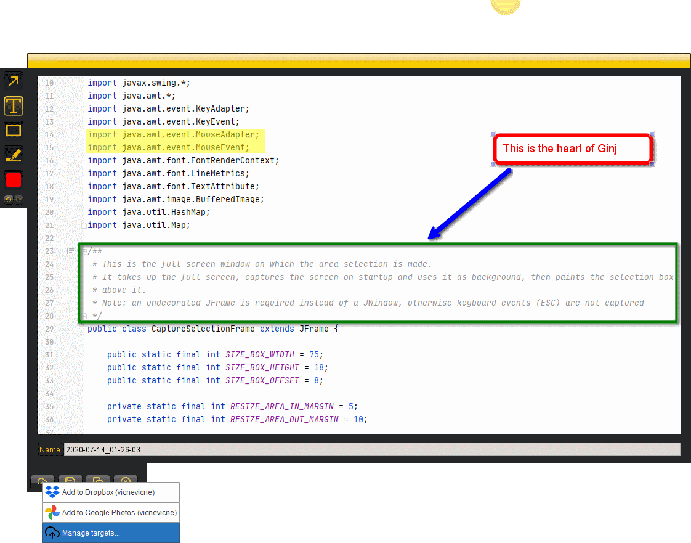

#### tl;dr

Download the .exe (Windows), .dmg (MacOS) or .sh (Linux) from [this page](https://github.com/Ginj-capture/Ginj/releases/latest).

#### What is Ginj?

Ginj is an open source multi-platform screen capture and recording tool.

Its unobtrusive user interface and no-nonsense "capture / annotate / share" workflow is hard to beat.

Ginj might remind you of a free tool called [Jing](http://web.archive.org/web/20181002042822/https://www.techsmith.com/jing-tool.html), that [Techsmith discontinued](https://feedback.techsmith.com/techsmith/topics/techsmith-jing-2019-announcement) in July 2020 (*). But although there are similarities in the way both tools behave, Ginj is not Jing.

#### What does it look like?

Looks familiar ?

##### What's the difference with Jing?

- It's all open-source. Of course, not a single line of code, not a single icon or font was taken from Jing. So basically _everything_ is different. 
- Since [Screencast.com](https://www.screencast.com/), Techsmith's online sharing platform, [does not have a public API](https://feedback.techsmith.com/techsmith/topics/screencast-api), I had to switch to other online sharing services. Ginj supports Dropbox and Google Photos for now.
- Ginj will never be "discontinued". It's open source. Take it, use it, keep it, fork it, improve it, change it.
- A few new features could be added, but I really want to stick to the simple UI I love. 
- Oh, and Ginj is written in Java.

#### Why Ginj?

- Because I was a very satisfied user of Jing and I was sad to see it go. Call me old-fashioned... 
- Because no other tool on the market satisfied me.
- Because I was looking for a challenge during the Covid-19 lockdown. Maybe that went a little bit overboard :-).

#### Yeah, but why the name Ginj?
- Because as I said, **G**inj **I**s **N**ot **J**ing.

#### What is the status of Ginj? 

Ginj is still under heavy work. The goal is to cover the features of the original Jing, and maybe bring minimal enhancements, but many of them are still missing. A partial TO-DO list can be found [here](todo.md).

However, basic still image capture, annotation and sharing works quite well already.

#### Is it multi-platform?

Ginj's core is pure Java, and Java is "write once, run anywhere", so yes, it runs on any platform... 

Just kidding.

Ginj targets OpenJDK 14, so obviously Ginj won't ever run on a platform that does not support that JDK version. Moreover, I don't own a Mac, and I don't intend to test Ginj on a Linux VM until my to-do list becomes manageable.

In other words, until now, Ginj has almost exclusively been tested on Windows.

However, early user feedback on Ubuntu indicates that the Desktop widget has visual issues but that captures are OK and can be copied, saved and shared online, which I find amazing since it never was launched under Linux before release. 
If you test it on other platforms, feel free to [open an issue](https://github.com/Ginj-capture/Ginj/issues) and tell me about your experience. I will update this section accordingly. 

#### How can I get support?

You can't :-)

If you think you have found a bug, feel free to [open an issue](https://github.com/Ginj-capture/Ginj/issues), but honestly I don't intend this project to ever be bug-free or feature-complete because I know I won't have time to support it in a professional way.

And if you miss a feature, there's even less chance I will have time to look into it. But tell me anyway. 

In the meantime, it's just there and it's free... Enjoy :-)

#### A note about app validation.
If you want to share captures via Dropbox or Google Photos, you will get lots of warnings about the dangers of using a non-validated application during the authorization process. 

Please don't be scared, this app is indeed not (yet) validated by Dropbox nor Google so this is perfectly normal. 

I intend to apply for validation, but in the meantime, you ~~can trust me~~ should never trust anyone, so please check the source code and verify Ginj does nothing bad. 

#### OK, I still want to try it.

Great. Head over to the [latest release page](https://github.com/Ginj-capture/Ginj/releases/latest), pick the installer for the platform of your choice (Linux and Mac were never tested) and run it. It contains a full Java VM so it's around 50Mb unfortunately.

Note 1: there's no splash screen yet, so look for the circle at the center top of your desktop.

Note 2: if you already have OpenJDK 14 installed and configured by default, you may alternately just download the executable .jar (around 5MB of which 600KB for Ginj code and the rest for libraries) and launch Ginj by typing `java -jar Ginj.jar` in the download folder.

#### Credits. 

The app makes use of the following libraries:
- [HttpComponents](https://hc.apache.org/), Copyright © 2005–2020 The Apache Software Foundation
- [GSon](https://github.com/google/gson), Copyright © 2008 Google Inc.
- [SLF4j](http://www.slf4j.org/), Copyright © 2004-2017 QOS.ch
- Wizard by Timothy Boudreau of Netbeans, originally hosted at https://wizard.dev.java.net , v1.1 saved from the internet drain by Lonzak and available at https://github.com/Lonzak/Wizard-API (in source version as it's pre-Maven).
- [JKeyMaster](https://github.com/tulskiy/jkeymaster), Copyright © 2011 Denis Tulskiy

The source code contains classes or snippets from:
- The open source [EaSynth_Look_And_Feel_Bundle.zip](http://www.easynth.com/freewares/EaSynthLookAndFeel.html)
- [The Java Tutorial](https://docs.oracle.com/javase/tutorial/), Copyright (c) 1995, 2008, Oracle and/or its affiliates. All rights reserved.
- [JHLabs image filters](http://jhlabs.com/ip/filters/index.html) by Jerry Huxtable
- SystemUtils from [Commons-lang](https://commons.apache.org/proper/commons-lang/)  
- [Desktop](https://github.com/jjYBdx4IL/misc/blob/master/swing-utils/src/main/java/com/github/jjYBdx4IL/utils/awt/Desktop.java) Copyright © 2017 jjYBdx4IL (https://github.com/jjYBdx4IL)
- Discussions at [StackOverflow](https://stackoverflow.com/) and [CodeRanch](https://coderanch.com/) - hats off to MadProgrammer, camickr, and others.

The user interface uses: 
- Many icons from [FeatherIcons](https://feathericons.com/)
- Undo icon by Denis Klyuchnikov from [The Noun Project](https://thenounproject.com/)
- Laptop icon from [Icons8](https://icons8.com/)
- FTP icon by Pixel perfect from [flaticon](http://www.flaticon.com)

Many thanks to: 
- [ej-technologies](https://www.ej-technologies.com/) for providing free licences of [Install4J, the best multi-platform installer builder](https://www.ej-technologies.com/products/install4j/overview.html) for non-profit open source projects.
- [Techsmith](https://www.techsmith.com/) for having proposed and supported Jing for so long. Check out their product line.

#### License.

Ginj is released under the [GPL-3 License](LICENSE).

#### Privacy.

Please review [Ginj's privacy policy](https://github.com/Ginj-capture/Ginj/blob/master/privacy.md).
In short, Ginj does not spy on you, but the auto-update process connects back to Ginj's website to check for availability of a new version. 
If you configure sharing via third party services, their respective privacy policies apply of course.

(*) Starting July 14, 2020, Jing shows an error message on startup saying "Jing's not really sure what happened" then closes. Clicking 'Details' shows "Jing Warning - The API returned an error when calling: "Screencast.User.GinInfo" this version of the Screencast API is no longer supported".